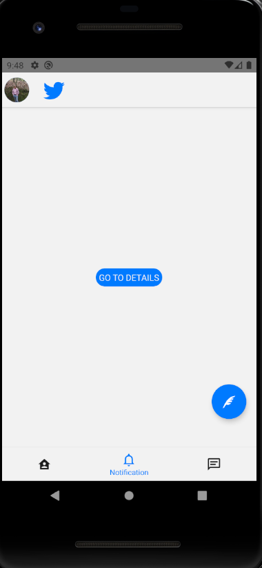
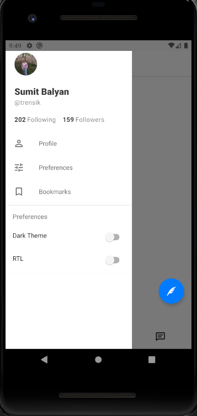
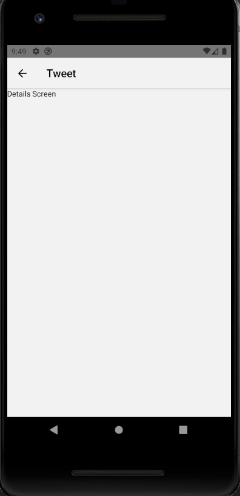
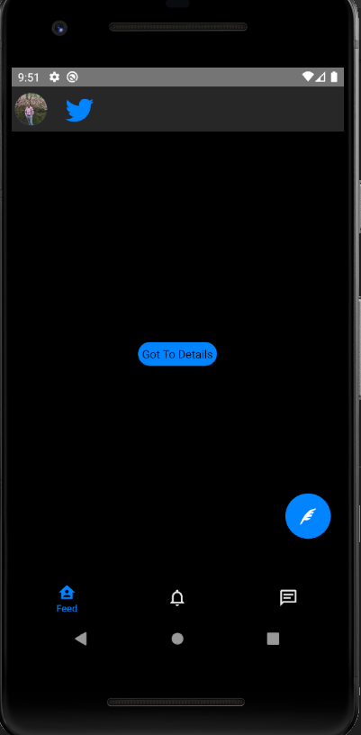
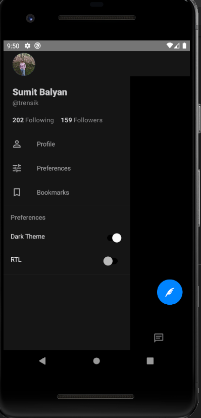
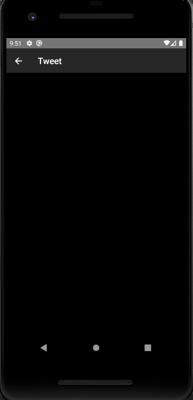

This project is build up with new features of React navigation v5 and react-native-paper. Which gives a rich look to drawer, tabs as well as dark and light themes. Dynamically dark or light mode change.

## Available Scripts

In the project directory, you can run:

### `npx react-native run-android`

## Home(light mode) screen

[]

## Drawer(light mode) screen

[]

## Details(light mode) screen

[]

## Home(dark mode) screen

[]

## Drawer(dark mode) screen

[]

## Details(dark mode) screen

[]

